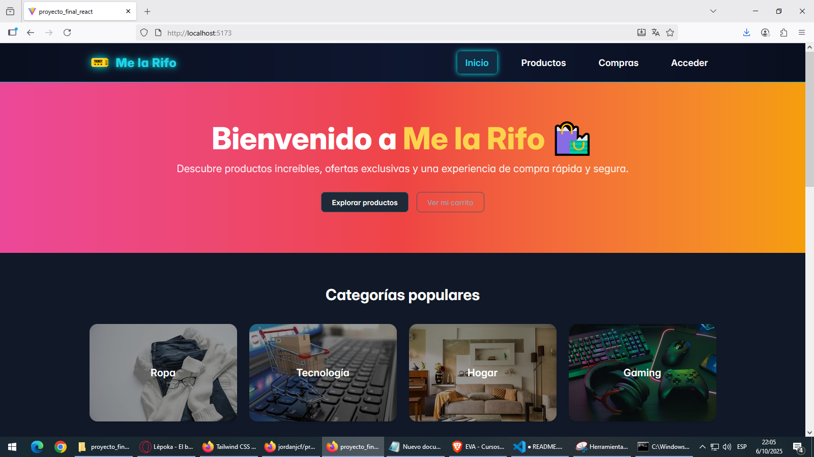
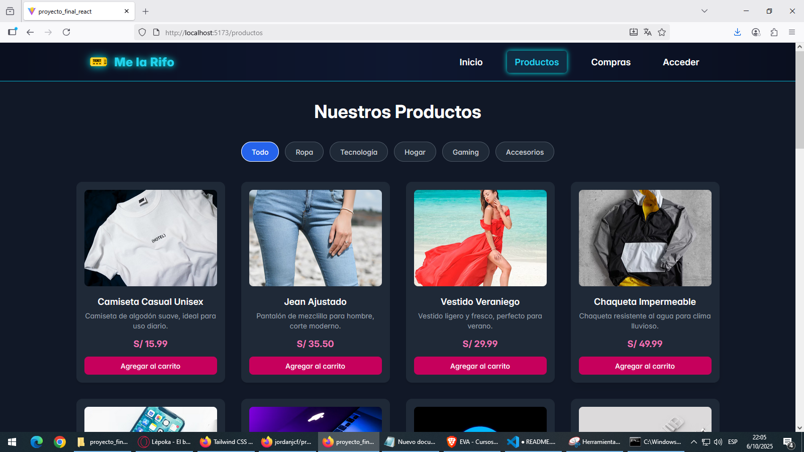
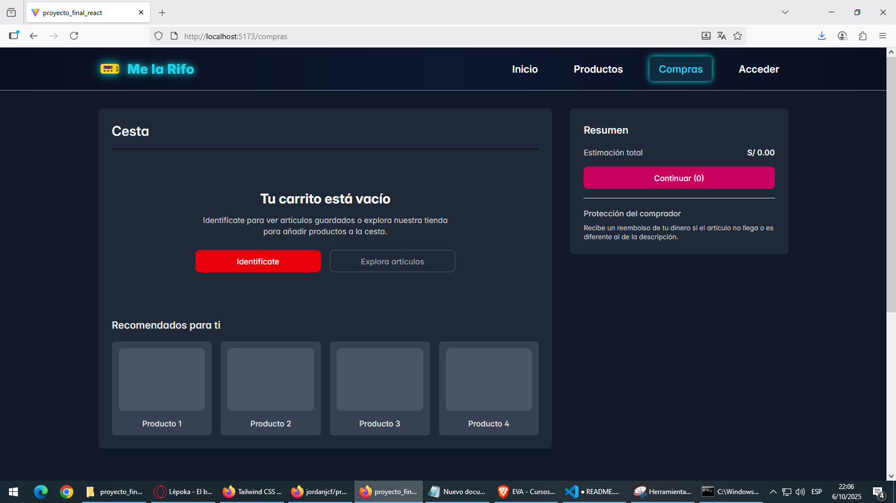
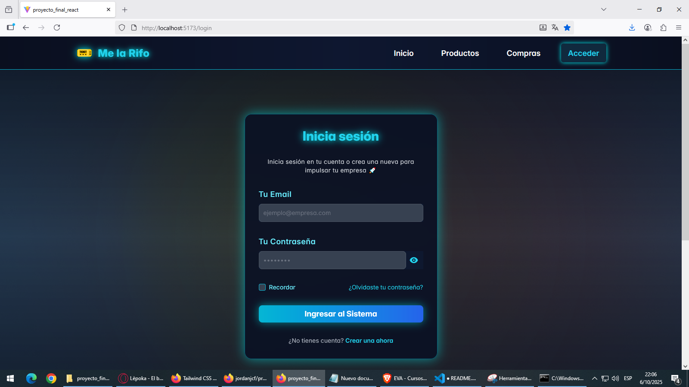

# Proyecto Final React – E-Commerce


## Descripción

Este proyecto es un **e-commerce moderno** desarrollado con **React y Vite**.  
Permite explorar productos, filtrarlos por categorías y agregarlos al carrito de manera interactiva y fluida.  
El diseño es **responsive**, funcional y visualmente atractivo, combinando **TailwindCSS**, **Flowbite React** y **PrimeReact** para componentes UI.

---

## Tecnologías utilizadas

- **React + Vite** – Base del proyecto y desarrollo rápido.  
- **React Router** – Navegación entre páginas sin recargar.  
- **TailwindCSS** – Estilos y diseño responsive.  
- **Flowbite React** – Componentes UI (botones, footer, navbar, gallery).  
- **PrimeReact** – Sidebar, tablas y componentes avanzados.  
- **React Transition Group** – Animaciones y transiciones suaves.

---

## Características principales

- Filtrado de productos por categoría (Ropa, Tecnología, Hogar, Gaming).  
- Agregar productos al carrito y navegar a la página de compras.  
- Sidebar y navbar responsive.  
- Footer profesional con enlaces útiles.  
- Animaciones de transición para mejorar la experiencia de usuario.  
- Gestión de datos desde un archivo JSON para productos.  

---

## Instalación y ejecución local

1. Clona el repositorio:

```bash
git clone https://github.com/jordanjcf/proyecto_final_react.git


## Estructura del proyecto

src/
├─ assets/
│ ├─ imagenes/ # Imágenes de productos
│ │ ├─ Gaming.jpg
│ │ ├─ hogar.jpeg
│ │ ├─ ropa.jpg
│ │ └─ tecnologia.jpg
│ └─ logo/ # Logos del proyecto
│ ├─ tickets.png
│ └─ tickets2.png
├─ shater/
│ └─ react.svg # Iconos o ilustraciones
├─ components/ # Componentes reutilizables
│ ├─ Footer.jsx
│ └─ Navbar.jsx
├─ context/ # Context API
│ └─ CartContext.jsx
├─ pages/ # Páginas principales
│ ├─ Compras.jsx
│ ├─ Home.jsx
│ ├─ Login.jsx
│ └─ Productos.jsx
├─ shared/ # Estilos y configuración global
│ ├─ App.css
│ ├─ App.jsx
│ ├─ index.css
│ └─ main.jsx
└─ README.md

##Inicio



##Productos


##Compras


##Aceder
